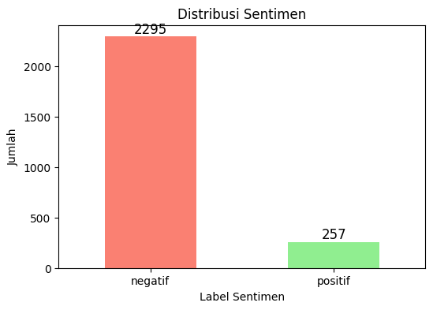
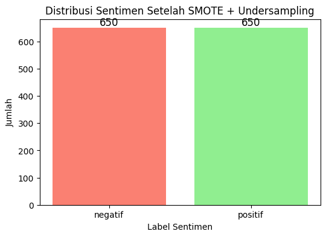
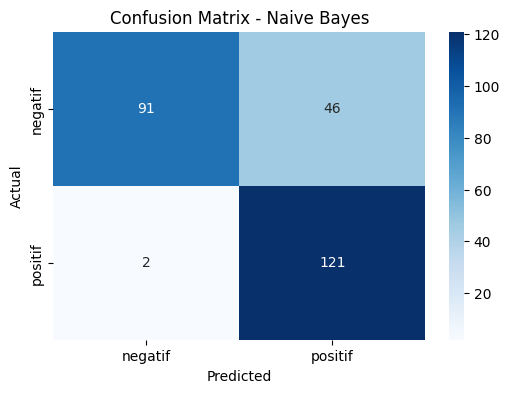

# Sentiment Analysis of Electric Vehicles in Indonesia using TF-IDF Naive Bayes Decision Tree
## 📌 Project Overview
This project performs **sentiment analysis on social media discussions about electric vehicles (EVs) in Indonesia)** to evaluate public perception toward EV adoption.

Two classification algorithms **Naive Bayes and Decision Tree** are compared using **TF-IDF feature extraction** to determine the best-performing model in classifying sentiments (Positive, Negative, Neutral).

The study aims to provide insight into public opinion trends and assess model performance using quantitative evaluation metrics.

## 🎯 Objectives
- Analyze public sentiment toward electric vehicles in Indonesia
- Transform textual data into numerical representation using **TF-IDF**
- Compare classification performance of:
  - **Naive Bayes**
  - **Decision Tree**
- Evaluate models using **accuracy, precision, recall, and F1-score**
- Identify dominant sentiment trends in EV discussions

## 📂 Dataset Information
1. Source: Social media X comments related to electric vehicles in Indonesia
2. Data Type: Text
3. Data Preprocessing:
  - Case folding
  - Tokenization
  - Stopword removal
  - Stemming
  - TF-IDF vectorization
4. Target Variable:
  - Positive
  - Negative

## 🛠 Tools & Technologies
1. Python
2. Google Colab
3. pandas, numpy
4. scikit-learn
5. Sastrawi (Indonesian stemming)
6. TF-IDF Vectorizer

## 🔬 Methodology
1️. Text Preprocessing
  - Cleaning noisy social media text
  - Removing URLs, punctuation, and emojis
  - Indonesian language normalization
  - Stopword filtering
  - Stemming using Indonesian morphological rules
2. Feature Extraction
  - Term Frequency – Inverse Document Frequency (TF-IDF)
3. Model Implementation
  - Naive Bayes (Multinomial)
  - Decision Tree Classifier
4️. Model Evaluation
  - Accuracy
  - Precision
  - Recall
  - F1-score
  - Confusion Matrix

## 📊 Quantitative Results
| Model         | Accuracy | Precision | Recall | F1-Score |
| ------------- | -------- | --------- | ------ | -------- |
| Naive Bayes   | 82%      | 85%       | 82%    | 81%      |
| Decision Tree | 99%      | 99%       | 99%    | 99%      |

📌 Decision Tree achieved near-perfect classification performance, significantly outperforming Naive Bayes across all evaluation metrics.

## 🔍 Key Quantitative Insights (Corrected & Strengthened)
- **Decision Tree achieved 99% accuracy**, outperforming **Naive Bayes by 17 percentage points**, indicating superior classification capability on this dataset.
- Precision, Recall, and F1-Score for Decision Tree all **reached 0.99**, demonstrating:
  - Extremely low false positives
  - Extremely low false negatives
  - Highly balanced classification across sentiment classes
- Naive Bayes **achieved 82% accuracy**, showing solid but significantly lower performance compared to Decision Tree.
- The performance gap suggests that:
  - The dataset likely contains strong feature separability after TF-IDF transformation.
  - Decision Tree was able to capture non-linear relationships between terms and sentiment classes more effectively.

 ## 📊 Visualizations
 ### 1. Labeling Positive & Negative

### 2. Sentiment After SMOTE and Undersampling

### 3. Confusion Matrix Naive Bayes

### 4. Decision Tree (max_depth=3)
.png)
